# Way - AI-Powered Development Workflow Tool

Way is a sophisticated containerized development environment that orchestrates AI-powered project planning and execution workflows using Claude AI. It creates an AI-powered development team that can break down complex requirements, research solutions, implement code with quality controls, and validate work against acceptance criteria.

## Quick Setup

1. **Clone the repository** into your projects directory:
   ```bash
   cd ~/projects
   git clone <way-repo-url> .way
   ```

2. **Add the alias** to your `.bashrc`:
   ```bash
   echo 'alias dev="~/.way/docker/dev.sh"' >> ~/.bashrc
   source ~/.bashrc
   ```

3. **Start the development environment**:
   ```bash
   dev
   ```

## Prerequisites

- **Podman**: The container runtime used by way (Docker can be used with modifications)
- **Git**: For cloning the repository and version control
- **Claude CLI**: Installed automatically in the container

**If you do not use podman, modify docker/dev.sh for compatibility with your container runtime**

## How It Works

The `dev` alias runs a containerized development environment that:
- Mounts your current project directory to `/workspace` in the container
- Provides access to way commands in `/workspace/.way/commands/`
- Uses your host user ID/GID for proper file permissions
- Includes Python, Node.js, Claude CLI, Gemini CLI, and development tools
- Maintains git configuration from your host system

## Workflow Process

```mermaid
graph TD
    A[pdc <user-story>] --> B[Plan Phase]
    B --> B1[Story Creation<br/>00_story.md]
    B1 --> B2[Solution Search<br/>01_search.md]
    B2 --> B3[Solution Selection<br/>02_select.md]
    B3 --> B4[Solution Definition<br/>03_define.md]
    B4 --> B5[Plan Creation<br/>04_plan.md]
    B5 --> B6[Epic Decomposition<br/>05_decompose.md]
    B6 --> C[Do Phase]
    C --> C1[Triage<br/>06_triage.md]
    C1 --> C2[Execute Task<br/>06_execute.md]
    C2 --> C3[Validate Task<br/>06_validate.md]
    C3 --> C4{More Tasks?}
    C4 -->|Yes| C1
    C4 -->|No| D[Check Phase]
    D --> D1[Review Completed Work]
    D1 --> D2[Generate Test Plans]
    D2 --> D3[Create Validation Docs]
    D3 --> D4[Validate Against Acceptance Criteria]
    D4 --> E[Complete Cycle]
    
    %% Styling
    style A fill:#e1f5fe
    style B fill:#fff3e0
    style C fill:#e8f5e8
    style D fill:#f3e5f5
    style E fill:#c8e6c9
    style B1 fill:#fff3e0
    style B2 fill:#fff3e0
    style B3 fill:#fff3e0
    style B4 fill:#fff3e0
    style B5 fill:#fff3e0
    style B6 fill:#fff3e0
    style C1 fill:#e8f5e8
    style C2 fill:#e8f5e8
    style C3 fill:#e8f5e8
    style C4 fill:#e8f5e8
    style D1 fill:#f3e5f5
    style D2 fill:#f3e5f5
    style D3 fill:#f3e5f5
    style D4 fill:#f3e5f5
```



## Available Commands

Once inside the container, you can use these commands from `/workspace/.way/commands/`:

### `plan.sh <user-story-name>`
Creates a complete project plan for a user story through 6 phases:
1. **Story Creation** - Uses `00_story.md` to create well-structured user stories
2. **Solution Search** - Uses `01_search.md` to research and analyze potential approaches
3. **Solution Selection** - Uses `02_select.md` to choose the optimal solution
4. **Solution Definition** - Uses `03_define.md` to create detailed specifications
5. **Plan Creation** - Uses `04_plan.md` to create implementation plans
6. **Epic Decomposition** - Uses `05_decompose.md` to break down into manageable tasks

**Example:**
```bash
plan.sh hypothesis-feedback-tool
```

### `do.sh <user-story-name>`
Executes development tasks from the plan with intelligent task management:
- **Triage** - Uses `06_triage.md` to select the next appropriate task
- **Execute** - Uses `06_execute.md` to implement tasks interactively (200-line limit per task)
- **Validate** - Uses `06_validate.md` to validate work interactively
- **Task Management** - Moves tasks between `todo/`, `doing/`, `done/`, `check/`, `blocked/`
- **Rate Limit Handling** - Automatic retry logic for Claude AI rate limits
- **Quality Controls** - Comprehensive validation including unit tests, integration tests, manual testing

**Example:**
```bash
do.sh hypothesis-feedback-tool
```

### `check.sh <user-story-name>`
Validates completed work and generates comprehensive test plans:
- Reviews completed tasks against acceptance criteria
- Creates validation documentation
- Generates test scenarios and coverage reports
- Ensures work meets quality standards

**Example:**
```bash
check.sh hypothesis-feedback-tool
```

### `act.sh <user-story-name>`
Executes focused tasks with specific prompts:
- Runs individual tasks with custom prompts
- Useful for targeted development work
- Provides direct control over task execution

**Example:**
```bash
act.sh hypothesis-feedback-tool
```

### `pdc <user-story-name>`
Project Development Cycle - runs the complete workflow:
- Combines plan, do, and check phases in sequence
- Automates the full development cycle
- Provides comprehensive logging of all operations
- Creates timestamped log files for tracking

**Example:**
```bash
pdc hypothesis-feedback-tool
```

## Project Structure

When you run way commands, they create this structure in your project:

```
project-repo/
└── docs/stories/
    └── user-story-name/
        ├── user-story.md              # Story definition
        ├── solution-space.md          # Research results
        ├── target-solution.md         # Selected solution
        ├── solution-specification.md  # Detailed specification
        ├── plan/                      # Implementation plan
        │   ├── README.md             # Overall plan
        │   └── epic-name/            # Epic breakdowns
        │       ├── README.md         # Epic overview
        │       └── task-files.md     # Individual tasks
        ├── delivery/                 # Execution tracking
        │   ├── todo/                 # Pending tasks
        │   ├── doing/                # Active tasks
        │   ├── done/                 # Completed tasks
        │   ├── check/                # Validation tasks
        │   └── blocked/              # Blocked tasks
        └── logs/                     # Execution logs
            └── pdc_YYYYMMDD_HHMMSS.log
```

## Key Features

### AI-Powered Decision Making
- **Specialized Prompts**: Each phase uses carefully crafted prompts that define the AI's role and capabilities
- **Bias Awareness**: Built-in bias management through the `seed.md` anchor file
- **Judgment Development**: Encourages critical thinking and constructive disagreement
- **Rate Limit Handling**: Automatic detection and retry logic for Claude AI rate limits

### Quality Controls
- **200-Line Limit**: Prevents over-engineering by limiting code additions per task
- **Comprehensive Validation**: Unit tests, integration tests, manual testing, acceptance criteria verification
- **Task Blocking**: Intelligent blocking mechanism when prerequisites aren't met
- **STOP_PRODUCTION.md**: Emergency halt mechanism for critical issues

### Structured Workflow
- **Phase-Based Execution**: Clear separation between planning, execution, and validation
- **Task State Management**: Systematic movement of tasks through different states
- **Interactive Execution**: Human oversight during critical implementation phases
- **Comprehensive Logging**: Detailed logs for debugging and process improvement

## Configuration

The container includes:
- Ubuntu 24.04 base
- Python 3 with pip and virtual environments
- Node.js 20.x with npm
- Claude CLI and Gemini CLI for AI interactions
- Development tools (git, vim, ripgrep, jq, aider, uv)
- Proper user permissions matching your host
- Git configuration from host system

## Troubleshooting

### Permission Issues
The container runs with your host user ID/GID, so file permissions should work correctly. If you encounter issues, check that the container is running with the correct user.

### Claude AI Rate Limits
The commands handle Claude AI rate limits automatically by:
- Detecting rate limit errors in command output
- Extracting retry timestamps from error messages
- Adding buffer time (10 minutes) to retry times
- Automatically retrying failed requests up to 3 times

### Container Build Issues
If the container build fails:
1. Ensure podman is installed and running
2. Check your internet connection
3. Try rebuilding: `podman build --no-cache -t dev-environment .way/docker/`

### Task Execution Issues
- Check for `STOP_PRODUCTION.md` file in delivery directory
- Verify task files are properly formatted
- Ensure prerequisites are met before execution
- Review logs in `docs/stories/<user-story>/logs/`

## Development

To modify way:
1. Edit files in `.way/commands/` for new commands
2. Update `.way/docker/Dockerfile` for container changes
3. Modify `.way/prompts/` for AI prompt changes
4. Update `.way/anchors/seed.md` for bias management
5. Test changes by rebuilding the container

## License

This project is licensed under the GNU General Public License v3.0 (GPL v3). See the [LICENSE](LICENSE) file for details.

The GPL v3 ensures that:
- You can use, modify, and distribute this software
- Any derivative works must also be distributed under GPL v3
- Source code must be made available when distributing modified versions
- This helps maintain the open source nature of the project and its derivatives 